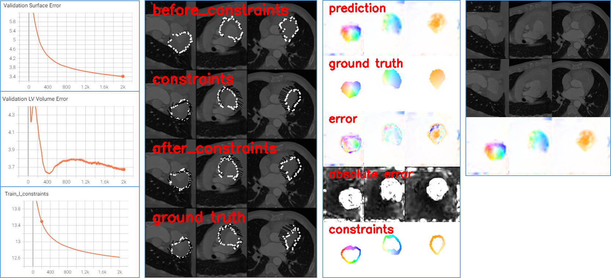

# 4D CT Cost Unrolling for Cardiac Optical Flow

## Overview
This repository is based on [github.com/gallif/_4DCTCostUnrolling](github.com/gallif/_4DCTCostUnrolling), designated for 3D optical flow over cardiac CT scans. It is centered around a 3D optical flow network, an extension of the ARFlow baseline, leveraging the PWC-Net architecture adapted for 3D imaging. The primary objective is to enable optimization over two timesteps of a single data sample (overfitting). 

Alongside standard loss functions like L1 and SSIM, this implementation incorporates additional **constraints loss**, particularly focusing on surface constraints located on the surface of a 3D segmentation mask (soon: see details in our [paper](link)).  Furthermore, it supports an anatomical loss, promoting maximal overlap between predicted and ground truth segmentation, inspired by [DeepStrain](www.frontiersin.org/articles/10.3389/fcvm.2021.730316/).

## Description
The core functionality of this codebase revolves around optimizing two timesteps of a single sample represented as a 3D NumPy array, typically CT scans. Two masks are essential for each timestep:
1. An `LV` encompassing the left ventricle myocardium and blood cavity, used for surface-related metrics computation and flow visualization.
2. A `shell` mask, containing solely the myocardium for volumetric metrics calculation within the myocardium. 

## Installation

```bash
pip install git+github.com/shaharzuler/four_d_ct_cost_unrolling.git
```

## Implemented Functions
The package provides several functions, including:

- `overfit_backbone()`: Optimizes the model optionally using L1 and SSIM losses.
- `overfit_w_constraints()`: Optimizes the model with additional constraints loss.
- `overfit_w_seg()`: Optimizes the model with additional anatomical loss.

- `validate_backbone()`, `validate_w_constraints()`, `validate_w_seg()`: Performs validation against ground truth notations.
- `infer_backbone()`, `infer_w_constraints()`, `infer_w_seg()`: Performs inference for given sample and checkpoints.

Additionally, utility functions such as `get_default_backbone_config()`, `get_default_w_segmentation_config()`, `get_default_w_constraints_config()`, 
`get_checkpoints_path()`, `get_default_checkpoints_path()`, `flow_warp()`, `rescale_flow_tensor()`, `rescale_mask_tensor()`, and `write_flow_as_nrrd()` are provided.

## Usage

To utilize the package:

- For optimizing without/with constraints: Use the `overfit_backbone()`/`overfit_w_constraints()`/

- For inference without/with constraints for given checkpoints: Employ `infer_backbone()`/`infer_w_constraints()`.

- For evaluating all metrics using given checkpoints without/with constraints: Utilize  `validate_backbone()`/`validate_w_constraints()`.

Similar usage for additional anatomical loss with functions `overfit_w_seg()`, `infer_w_seg()`, `validate_w_seg()`


### Example Usage

To train the network without constraints:

```python
args = get_default_backbone_config()
args["load"] = get_default_checkpoints_path()

backbone_model_output_path = overfit_backbone(
    template_image_path='path/to/1st/3D/image.npy',
    unlabeled_image_path='path/to/2nd/3D/image.npy', 
    template_LV_seg_path='path/to/1st/3D/LV/seg/map.npy', 
    unlabeled_LV_seg_path='path/to/2nd/3D/LV/seg/map.npy',    
    template_shell_seg_path='path/to/1st/3D/myo/seg/map.npy', 
    unlabeled_shell_seg_path='path/to/2nd/3D/myo/seg/map.npy',    
    flows_gt_path='path/to/1st/3D/ground_truth/array.npy', 
    error_radial_coordinates_path='path/to/arr/representing/radial/coordinates/projection.npy', # for metrics calculations and visualization
    error_circumferential_coordinates_path='path/to/arr/representing/circumferential/coordinates/projection.npy', # for metrics calculations and visualization
    error_longitudinal_coordinates_path='path/to/arr/representing/longitudinal/coordinates/projection.npy', # for metrics calculations and visualization
    voxelized_normals_path='path/to/sparse/arr/representing/LV/normals/projection.npy', # for metrics calculations and visualization
    args=EasyDict(args)
    )   
```

Refer to *`run.py`* for detailed usage examples.

Configurations adjustment in `args` as per `four_d_ct_cost_unrolling/src/configs`.

## Training Logs
Training logs and visualizations are saved by default in the directory:
**'outputs_[backbone/segmentation/constraints]_training_YYYYMMDD_HHMMSS'**

Example outputs:


## Full Implementation
For a comprehensive implementation of our paper, utilizing this package along with additional functionalities, please refer to [CardioSpectrum](github.com/shaharzuler/CardioSpectrum) implementation.